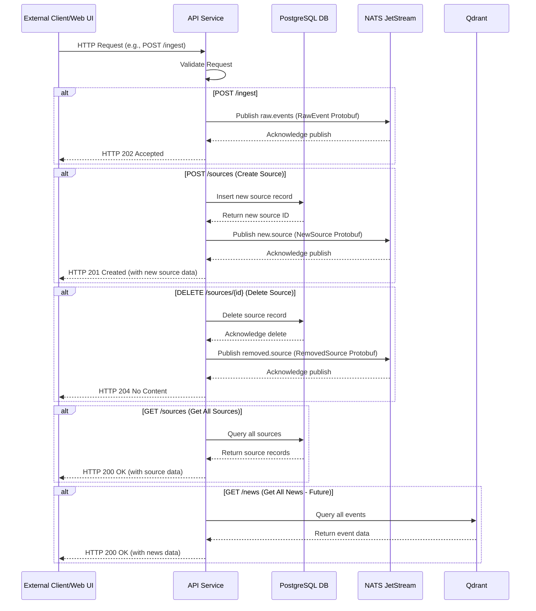
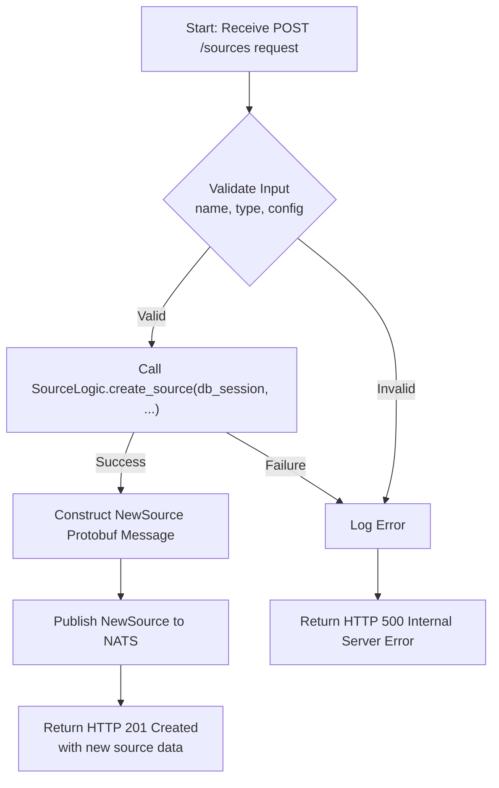

# API Service

## Overview

The `api` service serves as the unified gateway for external interactions with the Sentinel AI platform. It exposes a RESTful interface for various operations, including data ingestion, news retrieval, and source management. It acts as the primary entry point for users and other applications to interact with the system.

Its core responsibilities include:
1.  **Ingestion**: Accepting raw data and queuing it for processing.
2.  **Retrieval & Listing**: Providing endpoints to retrieve and list news events (all, filtered, or ranked).
3.  **Source Management**: Allowing CRUD (Create, Read, Update, Delete) operations for data sources.
4.  **Event Publication**: Publishing specific events to NATS JetStream to trigger downstream microservices.

## Core Functionality

The `api` service handles various types of requests, orchestrating interactions with PostgreSQL for source management and NATS for event-driven communication.

### 1. Data Ingestion (`POST /ingest`)

This endpoint accepts raw event data. Instead of processing it directly, the `api` service publishes these events to the `raw.events` NATS stream. This asynchronous approach ensures high throughput and decouples the ingestion process from immediate processing.

### 2. News Retrieval and Listing (`GET /news`, `/news/filtered`, `/news/ranked`, `/retrieve`)

These endpoints are designed to fetch news events. While currently returning mock data, their future implementation will involve querying Qdrant (the vector database) to retrieve events based on various criteria, including filtering and ranking scores determined by other services.

### 3. Source Management (`GET/POST/PUT/DELETE /sources`)

The `api` service provides a comprehensive set of endpoints for managing data sources. These operations interact directly with a PostgreSQL database via the shared `SourceLogic` module. Additionally, creating or deleting a source triggers a NATS event (`new.source` or `removed.source`) to notify other services (like the `scheduler`) about changes in the active data sources.

## Why YAML Configuration?

The `api` service itself does not directly use a YAML configuration file for its core logic or LLM parameters. Its behavior is primarily defined by its FastAPI routes and its interaction with other services. However, it's important to note that the data it exposes (e.g., filtered and ranked news) is a result of processing by other services (`filter`, `ranker`) that *do* heavily rely on external YAML configurations for their LLM prompts, filtering rules, and ranking algorithms. This design ensures that the `api` remains a stable interface while the underlying business logic can be dynamically tuned and updated via configuration in other services.

## Technical Deep Dive

The `api` service is built using FastAPI, providing a modern, fast, and asynchronous web framework. It integrates with SQLAlchemy for relational database interactions and NATS for inter-service communication.

### Data Flow and Processing Sequence

The following sequence diagram illustrates key interactions of the `api` service:

### Internal Logic Flow

The internal processing within the `api` service for a source creation request:

### Key Components and Dependencies

*   **FastAPI**: The web framework for building the API endpoints.
*   **SQLAlchemy**: ORM for interacting with the PostgreSQL database.
*   **`src/lib_py/logic/source_logic.py`**: Encapsulates business logic for source management.
*   **NATS JetStream**: Used for asynchronous event publishing (`raw.events`, `new.source`, `removed.source`).
*   **`src/lib_py/middlewares/JetStreamPublisher`**: Handles publishing messages to NATS streams.
*   **Protobufs (`raw_event_pb2`, `new_source_pb2`, `removed_source_pb2`)**: Define the structure of messages exchanged via NATS.
*   **`src/lib_py/middlewares/ReadinessProbe`**: Ensures the service's health can be monitored via a `/healthz` endpoint.
*   **`python-dotenv`**: For loading environment variables from `.env` files.

This overview provides a clear understanding of the `api` service's role, its internal workings, and its interactions within the Sentinel AI platform.