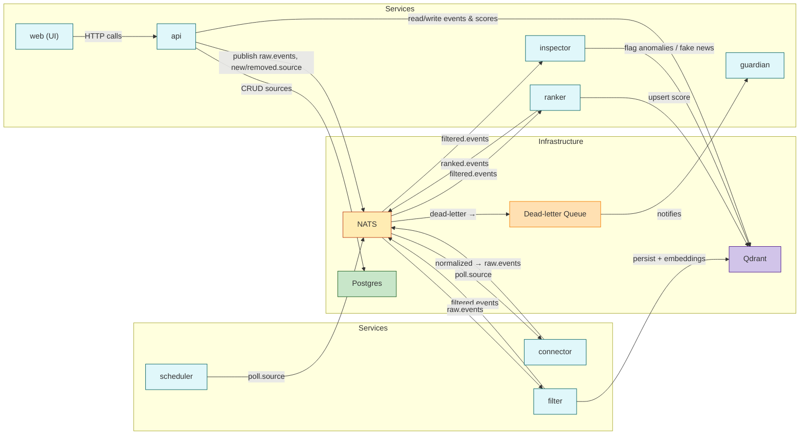

## Architecture Overview

This is a microservice, event-driven design built to run on a Kubernetes cluster 
(docker cluster suggested only for development or test purposes). 
Each service is independently deployable, horizontally scalable, and communicates via NATS pub/sub 
for high throughput and low latency. With Kubernetes’ auto-scaling and NATS JetStream for 
durable streams, this architecture can effortlessly serve millions of users in real time.

## Service Matrix

| Service       | Description                                                                                          | Responsibility                                                                                                                                                                                                                                                                                                                                          | Publishes to                                     | Subscribes to                              | DB Access                                                              |
|---------------|------------------------------------------------------------------------------------------------------|--------------------------------------------------------------------------------------------------------------------------------------------------------------------------------------------------------------------------------------------------------------------------------------------------------------------------------------------------------|--------------------------------------------------|--------------------------------------------|------------------------------------------------------------------------|
| [**api**](./api.md)       | Unified gateway for ingestion, retrieval, news listing, UI ranking, re-ranking, and source management | • Ingestion: POST `/ingest` → `raw.events`   • Retrieval: GET `/retrieve?batch_id=`   • List all news: GET `/news`   • List filtered news: GET `/news/filtered`   • Default ranking & UI: GET `/news/ranked`   • Dynamic re-rank: POST `/news/rerank`   • Source Manager (CRUD): GET/POST/PUT/DELETE `/sources` → `new.source` / `removed.source` | `raw.events` `new.source` `removed.source` | —                                          | Reads from: Qdrant (events & scores) Reads/Writes PostgreSQL (sources) |
| [**scheduler**](./scheduler.md) | Schedules polling jobs for live feeds                                                                | Maintain poll schedules (via APScheduler); emit `poll.source` when sources are added/removed                                                                                                                                                                                                                                                            | `poll.source`                                    | `new.source` `removed.source`            | —                                                                      |
| [**connector**](./connector.md) | Fetches & normalizes data from live sources                                                          | Subscribe to `poll.source`; fetch & normalize each live source; publish normalized events                                                                                                                                                                                                                                                               | `raw.events`                                     | `poll.source`                              | —                                                                      |
| [**filter**](./filter.md)    | Filters events for relevance, enriches with embeddings, and persists them                            | Subscribe to `raw.events`; apply relevance filters; compute embeddings; persist full event (metadata + embedding) to Qdrant; publish `filtered.events`; ack only on success                                                                                                                                                                            | `filtered.events`                                | `raw.events`                               | Writes to Qdrant (events & embeddings)                                 |
| [**ranker**](./ranker.md)    | Computes and persists deterministic event scores                                                     | Subscribe to `filtered.events`; compute Importance×Recency scores; upsert score into Qdrant; publish `ranked.events`; ack only on success                                                                                                                                                                                                                 | `ranked.events`                                  | `filtered.events`                          | Writes to Qdrant (scores)                                              |
| [**inspector**](./inspector.md) | Detects anomalous or fake items and flags them in the datastore                                      | Subscribe to `filtered.events`; detect anomalies and fake news; update anomaly flag on the corresponding Qdrant record; ack only on success                                                                                                                                                                                                             | —                                                | `filtered.events`                          | Writes anomaly flag to Qdrant                                          |
| [**guardian**](./guardian.md)  | Monitors NATS dead-letter queue and alerts on messages that exhaust retries                          | Subscribe to NATS dead-letter queue; after configured retries are exhausted, send alerts/notifications (e.g., email, Slack, PagerDuty)                                                                                                                                                                                                                  | Alerts/Notifications (external)                  | NATS dead-letter queue                      | —                                                                      |
| [**web**](../readme.md)       | User-facing UI for listing, filtering, reranking, deleting events and managing sources               | Render dashboards and lists; call API endpoints (`/news*`, `/sources*`, `/ingest`, `/retrieve`, etc.); provide controls for reranking and CRUD ops                                                                                                                                                                                                    | —                                                | HTTP API endpoints on `api`                | —                                                                      |

This layout and matrix ensure every requirement—from ingestion through filtering, ranking, 
anomaly detection, retries, and UI—has clear ownership, data flow, and persistence.
