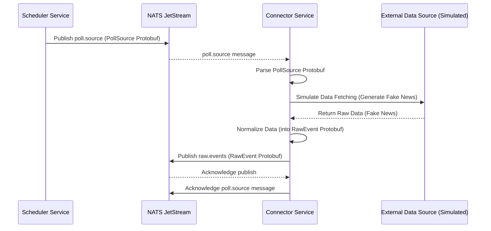
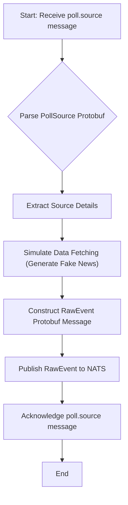

# Connector Service

## Overview

The `connector` service is responsible for fetching raw data from various external sources and normalizing it into a consistent format for the Sentinel AI platform. It acts as the bridge between external data feeds and the internal event processing pipeline.

Its core responsibilities include:
1.  **Subscribe** to `poll.source` events, which instruct it to fetch data from a specific source.
2.  **Fetch Data**: Retrieve raw data from the configured external source (e.g., RSS feed, API endpoint).
3.  **Normalize Data**: Transform the fetched raw data into a standardized `RawEvent` format.
4.  **Publish `raw.events`**: Send the normalized raw events to the `raw.events` NATS stream for further processing by the [`filter` service](./filter.md).

## Core Functionality: Data Ingestion and Normalization

The connector service is an event-driven component that reacts to polling requests from the [`scheduler` service](./scheduler.md).  
In the current **proof-of-concept** it uses Playwright + headless Chromium to fetch the landing page URL (`config.url`) and extracts `<a>` links as candidate news items. A lightweight Postgres table (`processed_items`) is used to avoid re-publishing the same link twice.

> ⚠️ **Not production-ready** – the scraper is intentionally naïve: no pagination, no JS login, no cookie handling, no rate-limiting, and it relies on simple heuristics (`len(text) > 25`, link starts with `http`). It is good enough to demonstrate the end-to-end pipeline but will need hardening for real-world news sites.

### Why the Reddit *r/cybersecurity* page yields zero links

Reddit post titles are typically short (“New Fortinet CVE” ≈ 20 chars).  Because the current filter keeps only anchors whose **visible text length is > 25 characters**, every Reddit anchor is discarded, so `_scrape_links()` returns an empty list.

To ingest Reddit you can either lower the threshold (e.g. `> 5`) or implement a CSS-selector rule that targets the `<h3>` post-title anchors.

### Suggested starter sources that fit the current heuristic

The following public pages have headline anchors well above 25 characters and work out-of-the-box:

| Source | URL to use in `config.url` |
|--------|----------------------------|
| SecurityWeek – Latest Cybersecurity News | https://www.securityweek.com/category/security-week-news/ |
| BleepingComputer – Security | https://www.bleepingcomputer.com/news/security/ |
| The Register – Security | https://www.theregister.com/security/ |
| TechCrunch – Security | https://techcrunch.com/tag/security/ |
| CSO Online – Security | https://www.csoonline.com/category/security/ |

### 1. Reacting to Poll Requests (`poll.source`)

When a `poll.source` event is received, the connector acknowledges the message. This event contains information about the source to be polled. The service then proceeds to simulate the data fetching and normalization process.

### 2. Scraping with Playwright (Current Logic)

1. Opens the URL in headless Chromium (timeout 15 s).  
2. Collects all anchors with an `href` attribute.  
3. Filters out short labels and non-http links.  
4. For each new link, stores a `(source_id, url)` row in `processed_items` and publishes a minimal `RawEvent` (title, timestamp, source).

If Playwright fails to load the page (network error, 4xx, etc.) the connector logs the error and NAKs the message so JetStream can redeliver.

### 3. Publishing Raw Events (`raw.events`)

After generating (or in the future, scraping and normalizing) a raw event, the connector publishes it to the `raw.events` NATS stream. This makes the event available to the [`filter` service](./filter.md), which is the next stage in the processing pipeline.

## Why YAML Configuration?

The connector service does not currently utilize a YAML configuration file for its core logic. Its behavior is primarily driven by the `poll.source` events it subscribes to. However, if complex scraping rules, source-specific parsing logic, or API credentials were to be externalized, a YAML configuration would be highly beneficial for managing these settings in a flexible and maintainable way.

If we later need per-site CSS selectors, auth cookies, or pagination depth, these could be expressed via YAML/JSON in the Source `config` and parsed by the scraper.

## Technical Deep Dive

The connector service is implemented in Python, leveraging `asyncio` for asynchronous operations and NATS JetStream for reliable messaging.

### Data Flow and Processing Sequence

The following sequence diagram illustrates how the connector service processes a `poll.source` event:

### Internal Logic Flow

The internal processing within the connector service for a `poll.source` event:

### Key Components and Dependencies

*   **NATS JetStream**: Used for asynchronous message passing (`poll.source` subscription, `raw.events` publication).
*   **`src/lib_py/middlewares/JetStreamEventSubscriber`**: Handles subscribing to NATS streams.
*   **`src/lib_py/middlewares/JetStreamPublisher`**: Handles publishing messages to NATS streams.
*   **Protobufs (`poll_source_pb2`, `raw_event_pb2`)**: Define the structure of messages exchanged via NATS.
*   **`src/lib_py/middlewares/ReadinessProbe`**: Ensures the service's health can be monitored.
*   **`python-dotenv`**: For loading environment variables from `.env` files.

This overview provides a clear understanding of the connector service's role, its current workings, and its future potential within the Sentinel AI platform.