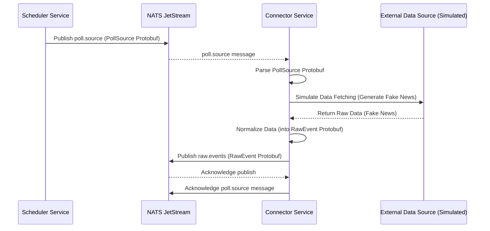
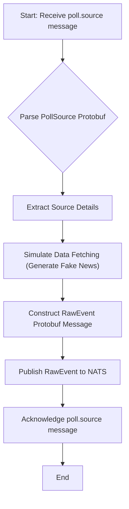

# Connector Service

## Overview

The `connector` service is responsible for fetching raw data from various external sources and normalizing it into a consistent format for the Sentinel AI platform. It acts as the bridge between external data feeds and the internal event processing pipeline.

Its core responsibilities include:
1.  **Subscribe** to `poll.source` events, which instruct it to fetch data from a specific source.
2.  **Fetch Data**: Retrieve raw data from the configured external source (e.g., RSS feed, API endpoint).
3.  **Normalize Data**: Transform the fetched raw data into a standardized `RawEvent` format.
4.  **Publish `raw.events`**: Send the normalized raw events to the `raw.events` NATS stream for further processing by the [`filter` service](./filter.md).

## Core Functionality: Data Ingestion and Normalization

The [`connector` service](./connector.md) is an event-driven component that reacts to polling requests from the [`scheduler` service](./scheduler.md). For now, it simulates data fetching and normalization by generating fake news events.

### 1. Reacting to Poll Requests (`poll.source`)

When a `poll.source` event is received, the [`connector`](./connector.md) acknowledges the message. This event contains information about the source to be polled. The service then proceeds to simulate the data fetching and normalization process.

### 2. Generating Fake News (Placeholder for Real Scraping)

Currently, the [`connector` service](./connector.md) generates a fake news event for each `poll.source` request. This serves as a placeholder for the actual data scraping and normalization logic that would be implemented in a real-world scenario. The fake news is structured as a `RawEvent` Protobuf message.

### 3. Publishing Raw Events (`raw.events`)

After generating (or in the future, scraping and normalizing) a raw event, the [`connector`](./connector.md) publishes it to the `raw.events` NATS stream. This makes the event available to the [`filter` service](./filter.md), which is the next stage in the processing pipeline.

## Why YAML Configuration?

The [`connector` service](./connector.md) does not currently utilize a YAML configuration file for its core logic. Its behavior is primarily driven by the `poll.source` events it subscribes to. However, if complex scraping rules, source-specific parsing logic, or API credentials were to be externalized, a YAML configuration would be highly beneficial for managing these settings in a flexible and maintainable way.

## Technical Deep Dive

The [`connector` service](./connector.md) is implemented in Python, leveraging `asyncio` for asynchronous operations and NATS JetStream for reliable messaging.

### Data Flow and Processing Sequence

The following sequence diagram illustrates how the [`connector` service](./connector.md) processes a `poll.source` event:

### Internal Logic Flow

The internal processing within the [`connector` service](./connector.md) for a `poll.source` event:

### Key Components and Dependencies

*   **NATS JetStream**: Used for asynchronous message passing (`poll.source` subscription, `raw.events` publication).
*   **`src/lib_py/middlewares/JetStreamEventSubscriber`**: Handles subscribing to NATS streams.
*   **`src/lib_py/middlewares/JetStreamPublisher`**: Handles publishing messages to NATS streams.
*   **Protobufs (`poll_source_pb2`, `raw_event_pb2`)**: Define the structure of messages exchanged via NATS.
*   **`src/lib_py/middlewares/ReadinessProbe`**: Ensures the service's health can be monitored.
*   **`python-dotenv`**: For loading environment variables from `.env` files.

This overview provides a clear understanding of the [`connector` service](./connector.md)'s role, its current workings, and its future potential within the Sentinel AI platform.