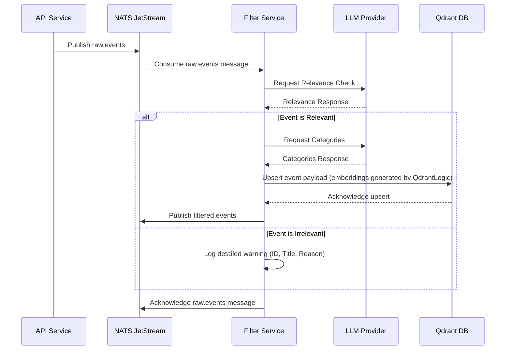

# Filter Service

## 1. Overview

The `filter` service is the primary gatekeeper of the Sentinel AI platform. It acts as the first line of defense and enrichment for all incoming raw data, ensuring that only relevant, high-quality information enters the system's core processing pipeline.

Its core responsibilities are:
1.  **Consume Raw Events**: Subscribe to the `raw.events` NATS subject, processing each incoming news event.
2.  **Apply LLM-Powered Filters**: Use a configured Large Language Model (LLM) to determine if an event is relevant to the platform's domain (e.g., IT management).
3.  **Discard or Enrich**:
    *   **Irrelevant Events**: Discard them immediately, logging the reason for full traceability.
    *   **Relevant Events**: Enrich them by using an LLM to assign categories.
4.  **Initial Persistence**: For relevant events, it orchestrates the first and only initial write to the Qdrant vector database. The underlying `QdrantLogic` library handles the creation of vector embeddings during this step.
5.  **Publish Filtered Events**: Publish the enriched and successfully persisted events as `FilteredEvent` messages to the `filtered.events` NATS subject for downstream consumption by the [`ranker` service](./ranker.md).

## 2. Core Functionality: LLM-Driven Analysis

The `filter` service leverages the power of LLMs to perform nuanced content analysis, acting as an intelligent gatekeeper to the vector database.

### Relevance Filtering

Upon receiving a `raw.event`, the service first assesses its relevance by sending the event's content to a configured LLM using a specific prompt. Events deemed irrelevant are **discarded** and never enter the database. A detailed warning is logged, including the event ID, title, and the LLM's reasoning, to ensure full traceability for rejected events.

### Categorization

For events that pass the relevance filter, the service makes a second LLM call to classify the event into one or more predefined categories. These categories are crucial for downstream services like the `ranker`, which uses them to calculate an event's importance.

## 3. Design Principle: Configuration-Driven Logic

The `filter` service's reliance on `filter_config.yaml` is a cornerstone of its flexible and powerful design. This approach cleanly separates the stable filtering logic from the volatile, domain-specific rules.

*   **Domain Agnosticism**: By externalizing LLM prompts, the service is not hardcoded to a specific domain. It can be repurposed for finance, healthcare, or any other industry by simply modifying the YAML configuration, without requiring code changes.
*   **Dynamic Adaptability**: The criteria for relevance and categorization can be updated on the fly by adjusting the prompts in the YAML file, allowing the system to adapt to evolving requirements or new trends.
*   **Separation of Concerns**: It cleanly separates the business logic of filtering from the specific content and parameters of the LLM interactions, promoting cleaner code and easier maintenance.
*   **Rapid Experimentation**: Different filtering strategies and LLM prompts can be easily A/B tested by modifying the YAML, facilitating rapid iteration and optimization.

**Example Configuration (`filter_config.yaml`):**
```yaml
filtering_rules:
  relevance_prompt: |
    You are an expert in IT news analysis. Your task is to determine if the following news article is relevant to an IT manager.
    Consider topics such as cybersecurity, cloud computing, network infrastructure, software development, data management, IT strategy, and compliance.
    Respond with "RELEVANT" if the article is highly relevant, "POTENTIALLY_RELEVANT" if it has some relevance, and "IRRELEVANT" otherwise.
    ---
    Article: {article_content}
    ---
    Relevance:
  category_prompt: |
    Based on the following article, classify it into one or more of these categories: Cybersecurity, Cloud Computing, Network Infrastructure, Software Development, Other.
    Respond with a comma-separated list of the most relevant categories.
    ---
    Article: {article_content}
    ---
    Categories:
```

## 4. Published Message Contract: `FilteredEvent`

When the `filter` finishes processing a relevant event, it publishes a `FilteredEvent` protobuf message to the `filtered.events` subject.

**Fields:**
- `id` (string)
- `title` (string)
- `timestamp` (string)
- `source` (string)
- `categories` (repeated string)
- `is_relevant` (bool)

## 5. Technical Deep Dive

### Data Flow Diagram

The following diagram illustrates how a raw event is processed by the `filter` service:



### Key Components and Dependencies

*   **NATS JetStream**: Used for asynchronous message passing (`raw.events` subscription, `filtered.events` publication).
*   **Qdrant**: The vector database where enriched event metadata and embeddings are stored.
*   **LLM Provider (OpenAI/Anthropic)**: External service used for relevance classification and categorization. Configured via environment variables (`LLM_PROVIDER`, `LLM_MODEL_NAME`, `OPENAI_API_KEY`, etc.).
*   **`src/lib_py/logic/QdrantLogic`**: Provides an abstraction layer for interacting with Qdrant. **Crucially, this library internally handles the generation of vector embeddings** from the event content before persisting it.
*   **`src/lib_py/middlewares/**`: A suite of custom middlewares for handling NATS connections and exposing a readiness probe.
*   **`src/lib_py/gen_types/**`: Contains the Protobuf definitions for `RawEvent` (input) and `FilteredEvent` (output).
*   **`PyYAML`**: Used for loading the filtering rules from `filter_config.yaml`.