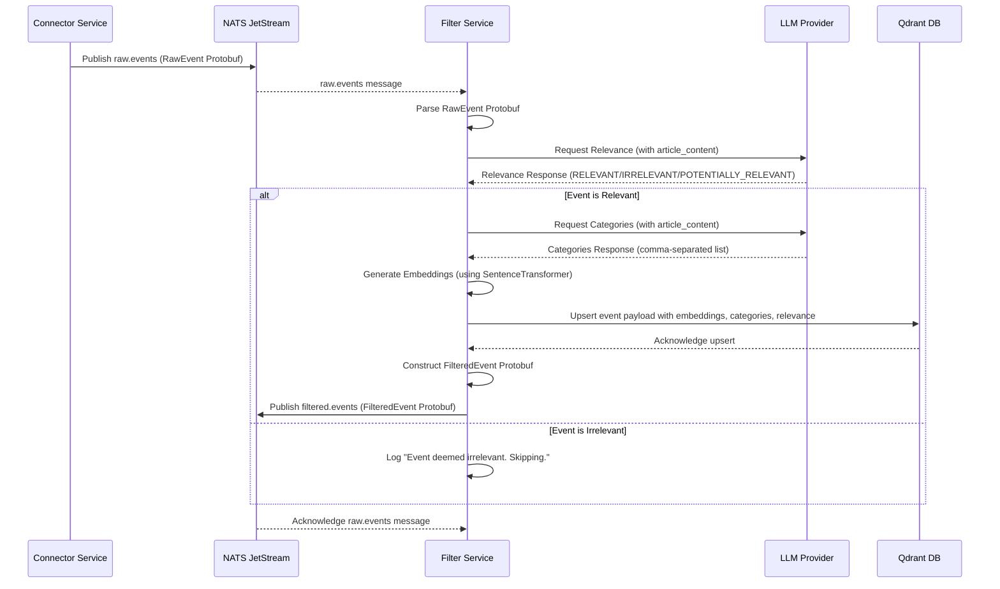

# Filter Service

## Overview

The `filter` service is a critical component of the Sentinel AI platform, acting as the first line of defense and enrichment for incoming news events. Its primary role is to process raw, uncurated events, determine their relevance, and prepare them for subsequent stages of ranking and analysis.

Its core responsibilities include:
1.  **Subscribe** to `raw.events` from the `connector` service.
2.  **Apply Relevance Filters**: Determine if an event is relevant to a specific domain (e.g., IT management) using a Large Language Model (LLM).
3.  **Enrichment**: If relevant, categorize the event and generate vector embeddings for its content.
4.  **Persistence**: Store the enriched event data (metadata, LLM-derived attributes, and embeddings) in Qdrant.
5.  **Publish** the processed and enriched events as `filtered.events` to a NATS stream.

## Core Functionality: Intelligent Filtering and Enrichment

The `filter` service leverages the power of LLMs to perform nuanced content analysis, making it highly adaptable to various domains.

### 1. Relevance Filtering with LLM

Upon receiving a `raw.event`, the `filter` service first assesses its relevance. This is achieved by sending the event's content to a configured LLM with a specific prompt designed to evaluate its pertinence to a defined context (e.g., an IT manager's interests). Events deemed irrelevant are discarded, reducing noise in the system.

**Example Configuration (`filter_config.yaml` - Relevance Prompt):**
```yaml
llm_config:
  provider: "openai"
  model_name: "gpt-4o-mini"
  api_key_env_var: "OPENAI_API_KEY"

filtering_rules:
  relevance_prompt: |
    You are an expert in IT news analysis. Your task is to determine if the following news article is relevant to an IT manager.
    Consider topics such as cybersecurity, cloud computing, network infrastructure, software development, data management, IT strategy, and compliance.
    Respond with "RELEVANT" if the article is highly relevant, "POTENTIALLY_RELEVANT" if it has some relevance but might require further review, and "IRRELEVANT" otherwise.
    ---
    Article: {article_content}
    ---
    Relevance:
```

### 2. Categorization with LLM

For events that pass the relevance filter, the service further enriches them by assigning categories. Another LLM prompt is used to classify the event into one or more predefined categories, providing structured metadata that can be used by downstream services (like the `ranker`).

**Example Configuration (`filter_config.yaml` - Category Prompt):**
```yaml
  category_prompt: |
    Categorize the following IT news article into one or more of these categories: [Cybersecurity, Cloud Computing, Network Infrastructure, Software Development, Data Management, IT Strategy, Compliance, Other].
    Respond with a comma-separated list of categories. If no category fits, respond with "Other".
    ---
    Article: {article_content}
    ---
    Categories:
```

### 3. Embedding Generation

To enable semantic search and similarity-based operations in Qdrant, the `filter` service generates vector embeddings for the content of each relevant event. This is done using a `SentenceTransformer` model, ensuring that the textual content is converted into a numerical representation that captures its meaning.

### 4. Persistence to Qdrant

All relevant and enriched events, including their original metadata, LLM-derived relevance flags and categories, and the generated vector embeddings, are stored in Qdrant. This makes the data readily available for fast retrieval, filtering, and ranking by other services.

## Why YAML Configuration?

The `filter` service's reliance on `filter_config.yaml` is a cornerstone of its flexible design:

*   **Domain Agnosticism**: By externalizing LLM prompts and filtering rules, the service is not hardcoded to a specific domain (e.g., IT news). It can be repurposed for finance, medical, or any other industry by simply modifying the YAML configuration, without requiring code changes.
*   **Dynamic Adaptability**: The criteria for relevance and categorization can be updated on the fly by adjusting the prompts and rules in the YAML file, allowing the system to adapt to evolving requirements or new trends.
*   **Separation of Concerns**: It clearly separates the business logic of filtering from the specific content and parameters of the LLM interactions, promoting cleaner code and easier maintenance.
*   **Experimentation**: Different filtering strategies and LLM prompts can be easily experimented with by modifying the YAML, facilitating rapid iteration and optimization.

## Technical Deep Dive

The `filter` service is implemented as a Python microservice, utilizing asynchronous programming with `asyncio` and NATS JetStream for efficient event processing.

### Data Flow and Processing Sequence

The following sequence diagram illustrates how a raw event is processed by the `filter` service:



### Internal Logic Flow

The internal processing of a `raw.events` message within the `filter` service follows these steps:

```mermaid
graph TD
    A[Start: Receive raw.events message] --> B{Parse RawEvent Protobuf};
    B --> C[Extract Event Content];
    C --> D{Call LLM for Relevance (relevance_prompt)};
    D -- LLM Response: IRRELEVANT --> E[Log: 🗑️ Event deemed irrelevant. Skipping.];
    D -- LLM Response: RELEVANT/POTENTIALLY_RELEVANT --> F{Call LLM for Categories (category_prompt)};
    F --> G[Generate Embeddings];
    G --> H[Upsert Event to Qdrant (with embeddings, categories, relevance)];
    H --> I[Construct FilteredEvent Protobuf];
    I --> J[Publish FilteredEvent to NATS];
    J --> K[Acknowledge raw.events message];
    E --> K;
    K --> L[End];
```

### Key Components and Dependencies

*   **NATS JetStream**: Used for asynchronous message passing between services (`raw.events` subscription, `filtered.events` publication).
*   **Qdrant**: The vector database where enriched event metadata and embeddings are stored.
*   **LLM Provider (OpenAI/Anthropic)**: External service used for natural language understanding, relevance classification, and categorization.
*   **`src/lib_py/middlewares/JetStreamEventSubscriber`**: Handles subscribing to NATS streams.
*   **`src/lib_py/middlewares/JetStreamPublisher`**: Handles publishing messages to NATS streams.
*   **`src/lib_py/middlewares/ReadinessProbe`**: Ensures the service's health can be monitored.
*   **`src/lib_py/logic/QdrantLogic`**: Provides an abstraction layer for interacting with Qdrant, including upserting event data.
*   **`src/lib_py/models/qdrant_models.py`**: Defines the data structures for events stored in Qdrant.
*   **`src/lib_py/gen_types/raw_event_pb2`**: Protobuf definition for incoming raw events.
*   **`src/lib_py/gen_types/filtered_event_pb2`**: Protobuf definition for outgoing filtered events.
*   **`SentenceTransformer`**: Used for generating vector embeddings from text content.
*   **`PyYAML`**: Used for loading the `filter_config.yaml` file.

This comprehensive overview should provide a clear understanding of the `filter` service's role, its internal workings, and its configurable nature within the Sentinel AI platform.
