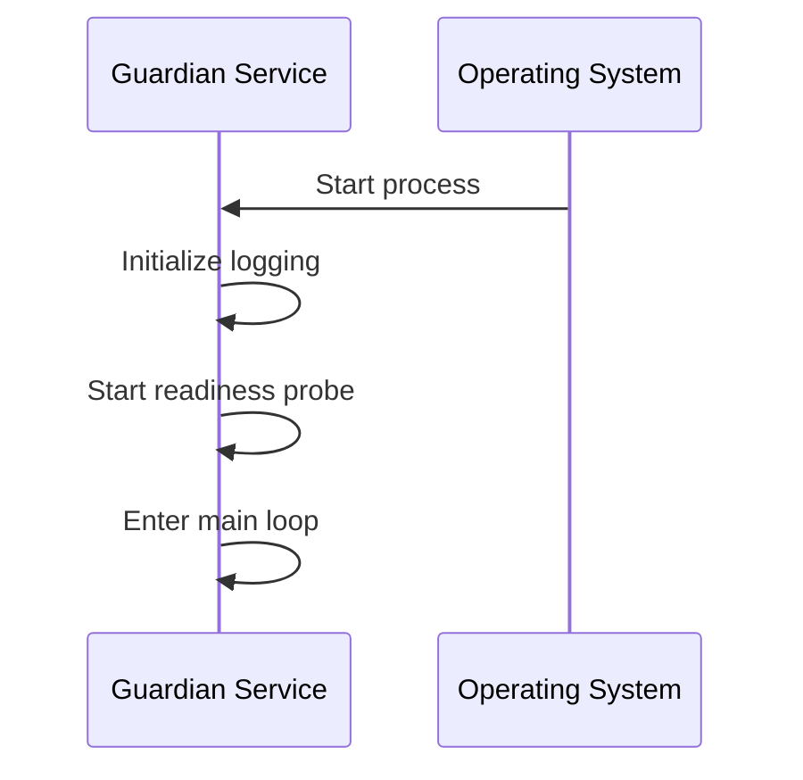
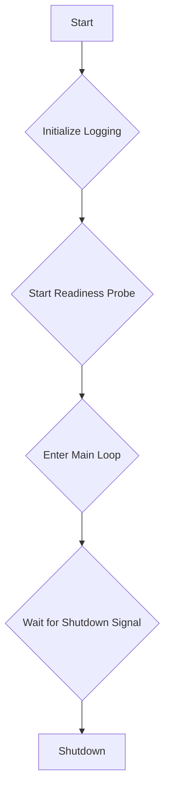

# Guardian Service

## Overview

The [`guardian_service`](./guardian.md) is a component of the Sentinel AI platform that is currently under development. Its name suggests a role in monitoring, security, or system health, but its specific responsibilities are not yet fully defined.

At present, the service is a placeholder, demonstrating the basic structure of a Sentinel AI microservice, including logging, environment variable loading, and a readiness probe.

## Core Functionality

The [`guardian_service`](./guardian.md) is a minimal, event-driven component. Its current implementation is limited to starting up, initializing a readiness probe, and logging its status. It does not yet subscribe to or publish any NATS events, nor does it interact with other services in the platform.

### 1. Readiness Probe

The service includes a readiness probe that exposes a `/healthz` endpoint. This allows a container orchestration system (like Kubernetes) to monitor the service's health and restart it if it becomes unresponsive.

## Why YAML Configuration?

The [`guardian_service`](./guardian.md) does not currently utilize a YAML configuration file. Its behavior is entirely determined by its source code and environment variables. However, as the service's functionality is developed, a YAML configuration could be introduced to manage settings such as:

*   **Monitoring thresholds:** Defining limits for system metrics (e.g., CPU usage, memory consumption) that would trigger alerts.
*   **Security policies:** Specifying rules for access control, rate limiting, or other security-related features.
*   **Alerting configurations:** Providing details for sending notifications (e.g., email addresses, webhook URLs) when specific events occur.

## Technical Deep Dive

The [`guardian_service`](./guardian.md) is implemented in Python, using `asyncio` for asynchronous operations.

### Data Flow and Processing Sequence

As the [`guardian_service`](./guardian.md) does not yet interact with other services, its data flow is minimal. The following diagram illustrates its startup sequence:

### Internal Logic Flow

The internal logic of the [`guardian_service`](./guardian.md) is straightforward:

### Key Components and Dependencies

*   **`src/lib_py/middlewares/ReadinessProbe`**: Ensures the service's health can be monitored.
*   **`python-dotenv`**: For loading environment variables from `.env` files.

This overview provides a clear understanding of the [`guardian_service`](./guardian.md)'s current state and its potential role within the Sentinel AI platform.
