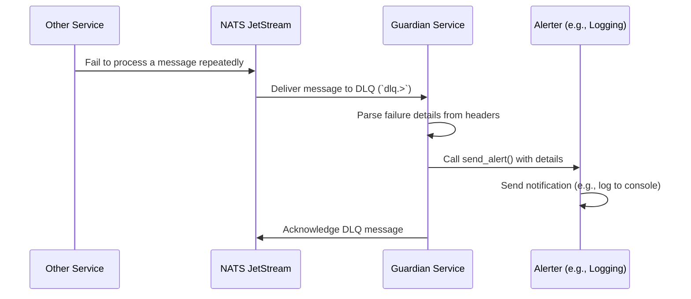
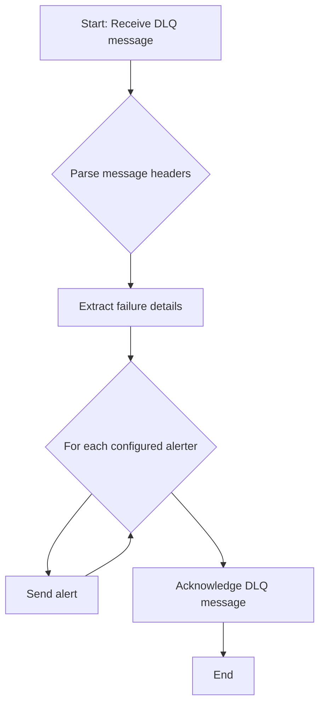

# Guardian Service

## Overview

The `guardian` service acts as the Sentinel AI platform's safety net. Its primary responsibility is to monitor the NATS Dead-Letter Queue (DLQ) for messages that could not be successfully processed by other services after multiple retries. By catching and reporting these failures, the `guardian` ensures that no message is silently lost and that system administrators are alerted to potential issues in the event processing pipeline.

Its core responsibilities include:
1.  **Subscribe to the DLQ**: It listens to the `dlq.>` subject in NATS JetStream, which receives all messages that have failed processing.
2.  **Process Failed Messages**: When a message is received, it extracts metadata about the failure, such as the original subject, sequence number, and reason for failure.
3.  **Send Alerts**: It uses a configurable set of alerters to send notifications about the failure to the appropriate channels (e.g., logs, external messaging systems).
4.  **Acknowledge DLQ Messages**: It acknowledges the message to ensure it is not re-processed by the `guardian` itself.

## Core Functionality

The `guardian` is an essential component for ensuring the reliability and observability of the platform.

### 1. Monitoring the Dead-Letter Queue (DLQ)

The service subscribes to all subjects under the `dlq.>` wildcard. This allows it to receive any message from any stream that has exhausted its retry attempts. This centralized monitoring is critical for maintaining system health.

### 2. Configurable Alerters

The `guardian` uses a flexible alerting mechanism. The `ALERTERS` environment variable specifies a comma-separated list of alerters to use. The current implementations include:
*   `LoggingAlerter`: Writes a critical-level log message with the failure details.
*   `FakeMessageAlerter`: A placeholder alerter for testing purposes.

This design is extensible, allowing new alerters (e.g., for Slack, PagerDuty, or email) to be easily added.

## Why YAML Configuration?

The `guardian` service does not currently use a YAML configuration file. Its behavior is configured entirely through environment variables (`ALERTERS`, `NATS_URL`, etc.).

For more complex alerter configurations that might require nested parameters or credentials (e.g., API keys, channel IDs), a YAML file would be a suitable choice. However, for the current implementation, environment variables are sufficient.

## Technical Deep Dive

The `guardian` service is implemented in Python, using `asyncio` for non-blocking operations and the `nats-py` library for JetStream communication.

### Data Flow and Processing Sequence

The following diagram illustrates how the `guardian` handles a failed message:

### Internal Logic Flow

The internal logic of the `guardian` service is as follows:

### Key Components and Dependencies

*   **NATS JetStream**: The message broker that provides the DLQ functionality.
*   **`src/lib_py/middlewares/JetStreamEventSubscriber`**: Handles the low-level details of subscribing to the DLQ stream.
*   **`src/lib_py/alerters`**: The module containing the `Alerter` base class and its concrete implementations (`LoggingAlerter`, `FakeMessageAlerter`).
*   **`src/lib_py/middlewares/ReadinessProbe`**: Exposes the `/healthz` endpoint for health monitoring.
*   **`python-dotenv`**: For loading environment variables.
