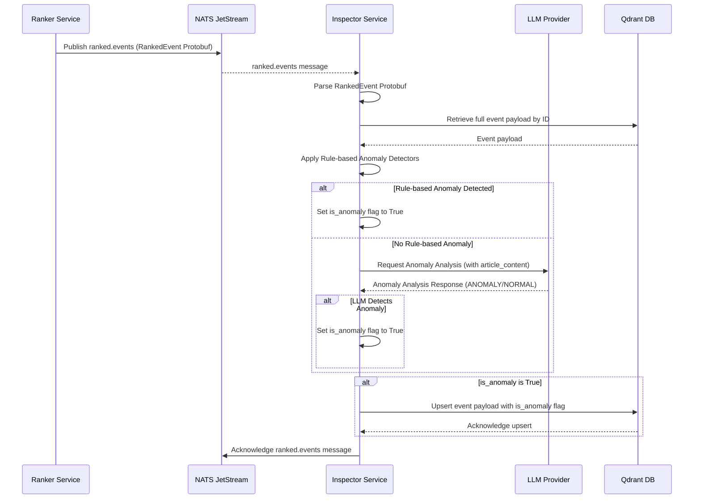
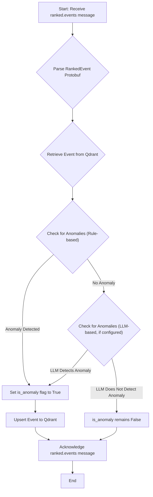

# Inspector Service

## Overview

The `inspector` service is a crucial component of the Sentinel AI platform, responsible for identifying and flagging anomalous or potentially fake news events. It acts as a quality control layer, ensuring that only reliable and valid information is processed and presented by the system.

Its core responsibilities include:
1.  **Subscribe** to `ranked.events` from the [`ranker` service](./ranker.md).
2.  **Apply Anomaly Detection Rules**: Analyze event content and metadata against a set of configurable rules, including rules powered by Large Language Models (LLMs).
3.  **Flag Anomalies**: If an event is deemed anomalous, update its record in the Qdrant vector database by setting an `is_anomaly` flag.
4.  **Acknowledge Messages**: Acknowledge the NATS message only after successful processing and Qdrant update.

## Core Functionality: Configurable Anomaly Detection

The `inspector` service uses a flexible, rule-based approach to detect anomalies. These rules are defined in `inspector_config.yaml`, allowing for easy customization and extension without requiring code changes.

### Anomaly Detection Rules

The `inspector_config.yaml` file contains a list of `anomaly_detectors`, each with a `type` and specific `parameters`:

```yaml
anomaly_detectors:
  - type: keyword_match
    parameters:
      keywords:
        - "spam"
        - "test"
        - "junk"

  - type: content_length
    parameters:
      min_length: 50
      max_length: 10000

  - type: missing_fields
    parameters:
      fields:
        - "title"
        - "content"

  - type: llm_anomaly_detector
    parameters:
      provider: "openai"
      model_name: "gpt-4o-mini"
      api_key_env_var: "OPENAI_API_KEY"
      prompt: |
        Analyze the following news article for potential anomalies, signs of fake news, or highly unusual content. 
        Consider the tone, factual consistency (if verifiable from content), and overall coherence. 
        Respond with "ANOMALY" if you detect a significant anomaly, otherwise respond with "NORMAL".
        --- 
        Article: {article_content}
        ---
        Analysis:
```

*   **`keyword_match`**: Flags an event if its `content` contains any of the specified `keywords` (case-insensitive).
*   **`content_length`**: Flags an event if the length of its `content` falls outside the specified `min_length` and `max_length` range.
*   **`missing_fields`**: Flags an event if any of the specified `fields` (e.g., `title`, `content`) are empty or missing.
*   **`llm_anomaly_detector`**: Leverages a Large Language Model to analyze the article content for anomalies. The `provider`, `model_name`, `api_key_env_var`, and `prompt` are configurable. The LLM's response is parsed to determine if an anomaly is detected.

## Input Data: The RankedEvent Message

The `inspector` service consumes `RankedEvent` messages, which are an evolution of the initial `FilteredEvent`. This message includes scoring information calculated by the `ranker` service.

### Note on Scoring Fields and Future-Proofing

The `RankedEvent` message contains three distinct scores:
1.  **`importance_score`**: Based on the event's category (e.g., 'cybersecurity' is high).
2.  **`recency_score`**: Based on how recently the event occurred.
3.  **`final_score`**: A weighted combination of the importance and recency scores.

Currently, the inspector's anomaly detection rules (defined in `inspector_config.yaml`) are focused on the content and structure of the event (e.g., keyword matches, content length, missing fields, LLM-based analysis). Therefore, these scores are not actively used in the anomaly detection logic itself, although the `final_score` is logged for visibility.

However, all three scores are passed to the inspector to make the system extensible. Future anomaly detection rules could easily leverage these scores for more sophisticated checks, for example:
- A **"Critical Event"** rule that flags events with an `importance_score` > 0.9.
- A **"Stale News"** rule that flags events with a very low `recency_score`.
- A **"Score Mismatch"** rule that checks for inconsistencies, like a high `final_score` for an event with very short content.

By including these fields now, we can add such rules in the future simply by modifying the configuration, without needing to change the data pipeline between services.

## Why YAML Configuration?

The use of `inspector_config.yaml` provides several benefits:

*   **Flexibility**: Anomaly detection rules can be easily updated, added, or removed without modifying the service's code.
*   **Domain Adaptability**: The service can be adapted to different domains or types of anomalies by simply changing the configuration.
*   **Separation of Concerns**: It cleanly separates the anomaly detection logic from the specific rules, making the codebase more modular and maintainable.
*   **Experimentation**: Different sets of rules can be tested and refined quickly.

## Technical Deep Dive

The `inspector` service is implemented in Python, leveraging `asyncio` for asynchronous operations and NATS JetStream for reliable messaging.

### Data Flow and Processing Sequence

The following sequence diagram illustrates how a ranked event is processed by the `inspector` service:



### Internal Logic Flow

The internal processing of a `ranked.events` message within the `inspector` service follows these steps:



### Key Components and Dependencies

*   **NATS JetStream**: Used for asynchronous message passing (`ranked.events` subscription).
*   **Qdrant**: The vector database where event metadata is stored and updated with anomaly flags.
*   **LLM Provider (OpenAI/Anthropic)**: External service used for advanced anomaly detection.
*   **`src/lib_py/middlewares/JetStreamEventSubscriber`**: Handles subscribing to NATS streams.
*   **`src/lib_py/middlewares/ReadinessProbe`**: Ensures the service's health can be monitored.
*   **`src/lib_py/logic/QdrantLogic`**: Provides an abstraction layer for interacting with Qdrant, including retrieving and upserting event data.
*   **`src/lib_py/gen_types/ranked_event_pb2`**: Protobuf definition for incoming ranked events.
*   **`PyYAML`**: Used for loading the `inspector_config.yaml` file.

This comprehensive overview provides a clear understanding of the `inspector` service's role, its internal workings, and its configurable nature within the Sentinel AI platform.