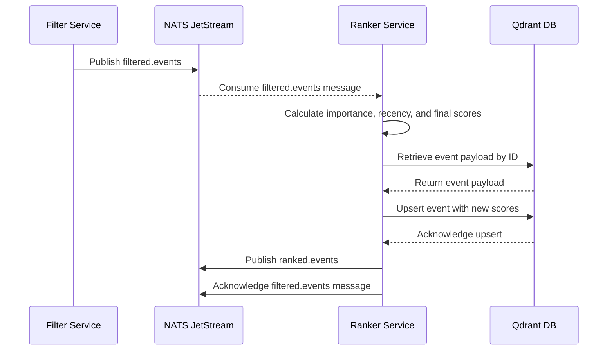

# Ranker Service

## 1. Overview

The `ranker` service is the core curation engine of the Sentinel AI platform. It is responsible for intelligently scoring and ordering news events based on their relevance and timeliness, ensuring that the most important and freshest content is prioritized for the end-user (e.g., an IT Manager).

Its primary responsibilities are:
1.  **Consume** `filtered.events` from the NATS JetStream, which are published by the [`filter` service](./filter.md).
2.  **Calculate Scores**: For each event, it computes three distinct scores:
    *   `importance_score`: Based on the event's categories.
    *   `recency_score`: Based on the event's timestamp using an exponential decay model.
    *   `final_score`: A configurable weighted average of the importance and recency scores.
3.  **Enrich Data**: It persists these three scores back into the event's record in the Qdrant vector database.
4.  **Publish Ranked Events**: It publishes a new `RankedEvent` message, containing the original event data plus the new scores, to the `ranked.events` NATS subject for consumption by downstream services like the [`inspector`](./inspector.md).

## 2. Core Functionality: The Scoring Algorithm

The `ranker` employs a deterministic, configurable algorithm to assign a `final_score`. This score is a weighted combination of two key factors, allowing for fine-tuned control over what content is prioritized.

### Importance Score

The importance of an event is a proxy for its relevance to the target audience. This is determined by the event's categories (assigned by the `filter` service). The `ranker_config.yaml` file maps specific categories to numerical importance values.

**Example Configuration (`ranker_config.yaml`):**
```yaml
category_importance_scores:
  Cybersecurity: 1.0
  Cloud Computing: 0.9
  Network Infrastructure: 0.8
  Software Development: 0.7
  Other: 0.1
```

### Recency Score

To ensure the newsfeed is timely, the `ranker` applies an exponential decay function to the event's timestamp. This means newer events are ranked higher, while older events gradually lose their value over time.

**Example Configuration (`ranker_config.yaml`):**
```yaml
recency_decay:
  half_life_hours: 72 # An event's recency score is halved every 3 days.
  max_score: 100.0    # The score for a brand-new event.
```

### Final Score Calculation

The `final_score` is a weighted sum of the two scores above. The weights are also configurable, allowing administrators to prioritize either the inherent importance of a topic or its freshness.

**Example Configuration (`ranker_config.yaml`):**
```yaml
ranking_parameters:
  importance_weight: 0.7
  recency_weight: 0.3
```

**Formula:**
`final_score = (importance_weight * importance_score) + (recency_weight * recency_score)`

## 3. Design Principle: Configuration-Driven Logic

The use of a dedicated `ranker_config.yaml` file is a core design principle that provides significant advantages:

*   **Tunability**: Business users or data scientists can easily adjust ranking parameters to meet changing priorities without requiring code changes or redeployments.
*   **Flexibility**: The service is domain-agnostic. It can be reconfigured for any subject (e.g., finance, healthcare) by simply updating the category scores and decay parameters in the YAML file.
*   **Separation of Concerns**: It cleanly separates the stable ranking algorithm from its volatile parameters, leading to more maintainable and readable code.
*   **Rapid Experimentation**: Different ranking strategies can be A/B tested by deploying `ranker` instances with different configurations.

## 4. Published Message Contract: `RankedEvent`

When the `ranker` finishes processing, it publishes a `RankedEvent` protobuf message to the `ranked.events` subject. Downstream services can rely on this contract.

**Fields:**
- `id` (string)
- `title` (string)
- `timestamp` (string)
- `source` (string)
- `categories` (repeated string)
- `is_relevant` (bool)
- `importance_score` (float)
- `recency_score` (float)
- `final_score` (float)

## 5. Technical Deep Dive

### Data Flow Diagram

The following diagram illustrates how an event flows through the `ranker` service:



### Key Components and Dependencies

*   **NATS JetStream**: For asynchronous message passing (`filtered.events` subscription, `ranked.events` publication).
*   **Qdrant**: The vector database where event metadata and scores are stored.
*   **`src/lib_py/middlewares/JetStreamEventSubscriber`**: Handles subscribing to NATS.
*   **`src/lib_py/middlewares/JetStreamPublisher`**: Handles publishing to NATS.
*   **`src/lib_py/middlewares/ReadinessProbe`**: Exposes a health check endpoint.
*   **`src/lib_py/logic/QdrantLogic`**: Provides an abstraction layer for interacting with Qdrant.
*   **`src/lib_py/gen_types/`**: Contains the Protobuf definitions for `FilteredEvent` (input) and `RankedEvent` (output).
*   **`PyYAML`**: Used for loading the `ranker_config.yaml` file.