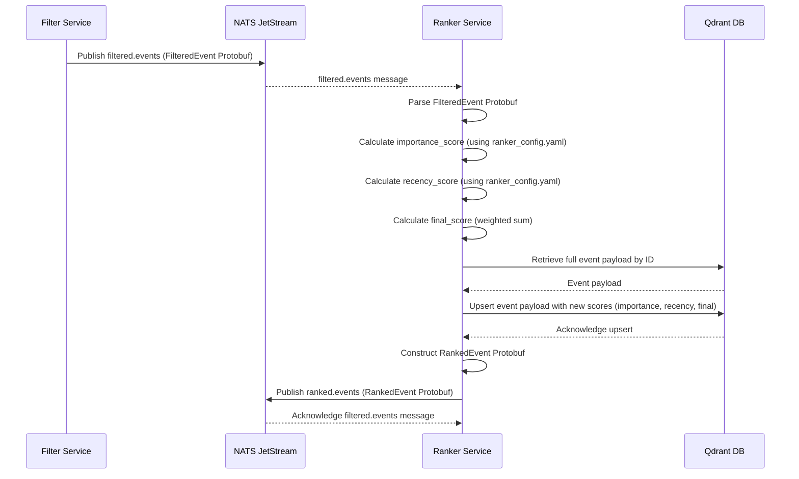

# Ranker Service

## Overview

The `ranker` service is a crucial component of the Sentinel AI platform, responsible for intelligently ordering news events based on their relevance and timeliness. It acts as an intermediary between the `filter` service, which identifies and enriches relevant events, and downstream services like the [`api`](./api.md) and `inspector`, which consume ranked data.

Its primary function is to:
1.  **Subscribe** to `filtered.events` from the [`filter` service](filter.md).
2.  **Compute** a deterministic ranking score for each event by balancing its "importance" (derived from LLM-based categorization) and "recency" (how recently it occurred).
3.  **Persist** these calculated scores back into Qdrant, enriching the event's metadata.
4.  **Publish** the newly ranked events as `ranked.events` to a NATS stream for consumption by other services.

## Core Functionality: Balancing Importance and Recency

The `ranker` service employs a configurable algorithmic approach to assign a `final_score` to each news event. This score is a weighted combination of two key factors:

### 1. Importance Score

The importance of an event is determined by its categories, which are assigned by the `filter` service using an LLM. The `ranker` service uses a predefined mapping of categories to numerical importance values, configured in `ranker_config.yaml`. This allows for flexible tuning of what topics are considered more "important" to the target audience (e.g., an IT manager).

**Example Configuration (`ranker_config.yaml`):**
```yaml
category_importance_scores:
  Cybersecurity: 1.0
  Cloud Computing: 0.9
  Network Infrastructure: 0.8
  Software Development: 0.7
  Data Management: 0.6
  IT Strategy: 0.5
  Compliance: 0.4
  Other: 0.1
```

The `calculate_importance_score` function sums the importance values of all categories associated with an event.

### 2. Recency Score

The recency of an event reflects how recently it was published or updated. The `ranker` service applies an exponential decay function to the event's timestamp to calculate its recency score. This ensures that newer events are generally ranked higher, but older, highly important events can still maintain relevance.

**Example Configuration (`ranker_config.yaml`):**
```yaml
recency_decay:
  half_life_hours: 72 # Event loses half its recency score every 72 hours
  max_score: 100.0 # Max score for a brand new event
```

The `calculate_recency_score` function uses the `half_life_hours` to determine the decay rate, ensuring that events gradually lose their recency value over time.

### 3. Final Score Calculation

The `final_score` is a weighted sum of the `importance_score` and `recency_score`. The weights are also configurable, allowing administrators to prioritize either the inherent importance of a topic or its freshness.

**Example Configuration (`ranker_config.yaml`):**
```yaml
ranking_parameters:
  importance_weight: 0.7
  recency_weight: 0.3
```

**Formula:**
`final_score = (importance_weight * importance_score) + (recency_weight * recency_score)`

## Why YAML Configuration?

The use of a dedicated `ranker_config.yaml` file is a deliberate design choice that offers several significant advantages:

*   **Flexibility and Agnosticism**: By externalizing ranking parameters, the `ranker` service remains generic and not hardcoded to a specific domain (e.g., IT news). It can be easily reconfigured for finance, healthcare, or any other domain by simply updating the YAML file with new category importance scores and decay parameters.
*   **Tunability by Non-Developers**: Business users, data scientists, or product managers can easily adjust ranking weights, category importance, and recency decay without requiring code changes or redeployments.
*   **Separation of Concerns**: It cleanly separates the ranking logic from its specific parameters, leading to more maintainable and readable code.
*   **A/B Testing**: Different ranking strategies can be A/B tested by deploying instances of the `ranker` service with different `ranker_config.yaml` files.

## Technical Deep Dive

The `ranker` service is implemented as a Python microservice, leveraging asynchronous programming with `asyncio` and NATS JetStream for efficient event processing.

### Data Flow and Processing Sequence

The following sequence diagram illustrates how an event flows from the `filter` service through the `ranker` service:



### Internal Logic Flow

The internal processing of a `filtered.events` message within the `ranker` service follows these steps:

flowchart TD
    A["Start: Receive filtered.events message"] --> B{"Parse FilteredEvent Protobuf"}
    B --> C["Extract Event Content, Categories, Timestamp"]
    C --> D["Calculate Importance Score"]
    D --> E["Calculate Recency Score"]
    E --> F["Calculate Final Score"]
    F --> G{"Retrieve Event from Qdrant"}
    G -->|Event Found| H["Update Event Payload with Scores"]
    G -->|Event Not Found| I["Log Warning: Event not in Qdrant"]
    H --> J["Upsert Updated Event to Qdrant"]
    J --> K["Construct RankedEvent Protobuf"]
    K --> L["Publish RankedEvent to NATS"]
    L --> M["Acknowledge filtered.events message"]
    M --> N["End"]
    I --> N


### Key Components and Dependencies

*   **NATS JetStream**: Used for asynchronous message passing between services (`filtered.events` subscription, `ranked.events` publication).
*   **Qdrant**: The vector database where event metadata, embeddings, and now ranking scores are stored and updated.
*   **`src/lib_py/middlewares/JetStreamEventSubscriber`**: Handles subscribing to NATS streams.
*   **`src/lib_py/middlewares/JetStreamPublisher`**: Handles publishing messages to NATS streams.
*   **`src/lib_py/middlewares/ReadinessProbe`**: Ensures the service's health can be monitored.
*   **`src/lib_py/logic/QdrantLogic`**: Provides an abstraction layer for interacting with Qdrant, including upserting event data.
*   **`src/lib_py/gen_types/filtered_event_pb2`**: Protobuf definition for incoming filtered events.
*   **`src/lib_py/gen_types/ranked_event_pb2`**: Protobuf definition for outgoing ranked events.
*   **`PyYAML`**: Used for loading the `ranker_config.yaml` file.

This comprehensive overview should provide a clear understanding of the `ranker` service's role, its internal workings, and its configurable nature within the Sentinel AI platform.
