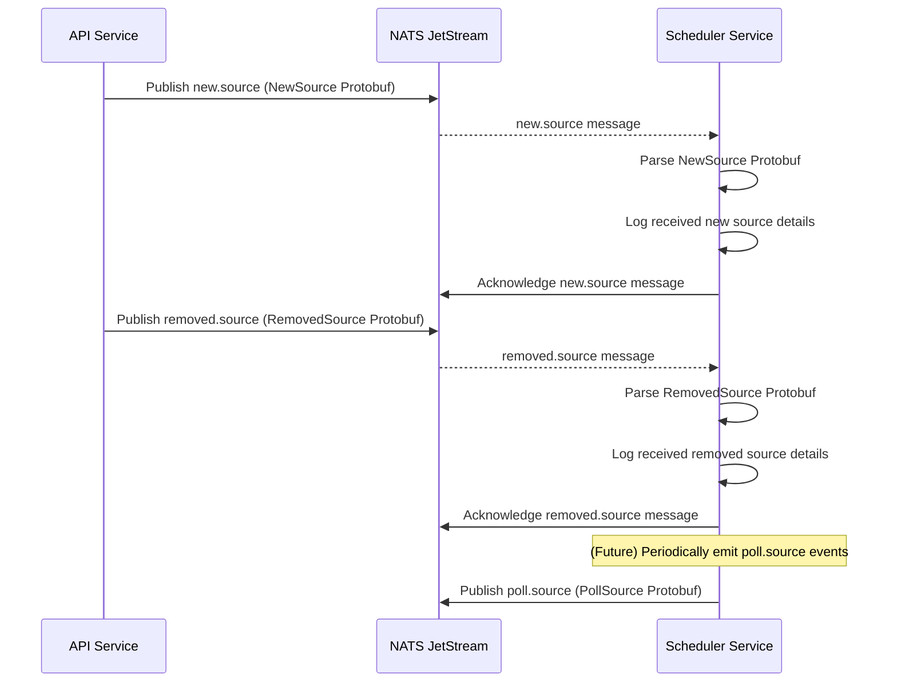
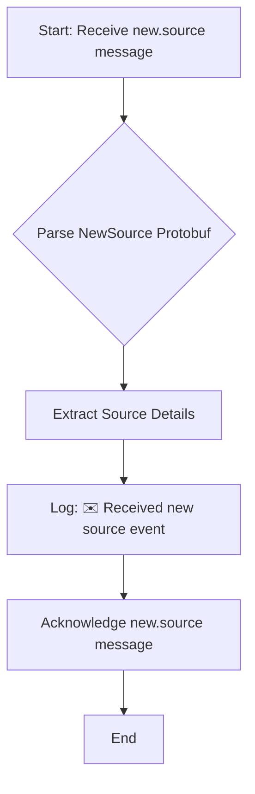

# Scheduler Service

## Overview

The `scheduler` service is responsible for managing the polling schedules of various data sources within the Sentinel AI platform. Its primary role is to react to changes in source configurations (newly added or removed sources) and, in the future, to periodically emit `poll.source` events to trigger data collection by the `connector` service.

Its core responsibilities include:
1.  **Subscribe** to `new.source` events, indicating a new data source has been added.
2.  **Subscribe** to `removed.source` events, indicating a data source has been removed.
3.  **Maintain Poll Schedules**: (Future implementation) Based on source configurations, schedule periodic `poll.source` events.
4.  **Emit `poll.source`**: Publish events to the `poll.source` NATS stream to initiate data fetching.

## Core Functionality

The `scheduler` service is an event-driven component that reacts to administrative changes in data sources. While its core scheduling logic (using APScheduler) is currently a placeholder, its event subscription mechanism is fully functional.

### 1. Reacting to New Sources (`new.source`)

When a `new.source` event is received, the `scheduler` acknowledges the message. In a future iteration, this would trigger the creation of a new polling job within APScheduler, configured to periodically fetch data from the newly added source.

### 2. Reacting to Removed Sources (`removed.source`)

Similarly, upon receiving a `removed.source` event, the `scheduler` acknowledges the message. The future implementation would involve identifying and removing the corresponding polling job from APScheduler, ensuring that data collection for the removed source ceases.

### 3. Emitting Poll Events (`poll.source`)

(Future Implementation) The `scheduler` will periodically publish `poll.source` events to a NATS stream. Each `poll.source` event will contain information about a specific data source, prompting the `connector` service to fetch data from that source.

## Why YAML Configuration?

The `scheduler` service does not currently utilize a YAML configuration file for its core logic. Its behavior is primarily driven by the NATS events it subscribes to and its internal scheduling mechanism (APScheduler). However, if complex scheduling rules or source-specific polling parameters were to be introduced, a YAML configuration would be highly beneficial for externalizing these settings, similar to how `filter` and `ranker` services manage their configurable aspects.

## Technical Deep Dive

The `scheduler` service is implemented in Python, leveraging `asyncio` for asynchronous operations and NATS JetStream for reliable messaging. It uses `APScheduler` for managing scheduled tasks.

### Data Flow and Processing Sequence

The following sequence diagram illustrates how the `scheduler` service reacts to source management events:

### Internal Logic Flow

The internal processing within the `scheduler` service for a new source event:

### Key Components and Dependencies

*   **NATS JetStream**: Used for asynchronous message passing (`new.source` and `removed.source` subscriptions, `poll.source` publication).
*   **`src/lib_py/middlewares/JetStreamEventSubscriber`**: Handles subscribing to NATS streams.
*   **`src/lib_py/middlewares/JetStreamPublisher`**: (Future use) Handles publishing `poll.source` messages.
*   **Protobufs (`new_source_pb2`, `removed_source_pb2`, `poll_source_pb2`)**: Define the structure of messages exchanged via NATS.
*   **`APScheduler`**: An asynchronous job scheduler for Python, used for managing polling jobs.
*   **`src/lib_py/middlewares/ReadinessProbe`**: Ensures the service's health can be monitored.
*   **`python-dotenv`**: For loading environment variables from `.env` files.

This overview provides a clear understanding of the `scheduler` service's role, its current workings, and its future potential within the Sentinel AI platform.
