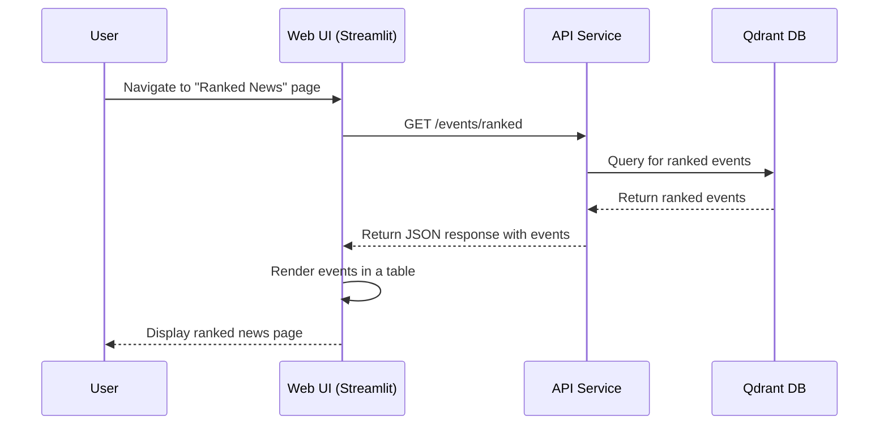

# Web Service

## Overview

The `web` service provides an interactive, user-friendly interface for the Sentinel AI platform. Built with Streamlit, it allows users to manage data sources, ingest new events, view filtered and ranked news feeds, and interact with the system's core functionalities without directly using the API.

> ⚠️ **Warning:** Somtimes the `web` service may not start correctly. Restart from Portainer.

Its primary features include:
1.  **Source Management**: A dedicated page to view, add, and remove data sources.
2.  **Data Ingestion**: A simple form to manually push new events into the system.
3.  **News Feeds**: Multiple views to see all events, filtered events, and ranked events.
4.  **Interactive Reranking**: The ability to adjust ranking parameters on the fly and see how it affects the news feed.

## Core Functionality

The `web` service acts as a client to the `api` service, making HTTP requests to fetch data and trigger actions.

### 1. Source Management
The **Manage Sources** page allows users to:
*   View a list of all existing data sources.
*   Add a new source by providing a name, URL, and type.
*   Delete an existing source.

### 2. Data Ingestion
The **Ingest Data** page provides a form for manually submitting a new raw event, which is then sent to the `api` service for processing.

### 3. News Feeds
The UI provides several views for monitoring events:
*   **All News**: Displays all events retrieved from the database.
*   **Filtered News**: Shows events that have been processed and deemed relevant by the `filter` service. **Note:** if the `ranker` service is running, relevant events are promoted to *Ranked News* almost instantly, so this view may appear empty. Stop the Ranker service and ingest a new event to observe items here.
*   **Ranked News**: Presents events with their calculated importance, recency, and final scores from the `ranker` service. **Note:** this view will only populate when the Ranker service is running and has processed events. If the Ranker is stopped, this table remains empty until it is restarted and new events flow through.

### 4. Interactive Reranking
The **Rerank News** page lets you enter a free-text query (e.g., “cybersecurity”) and choose how many results to return. The API reorders events by semantic similarity to your query, enabling ad-hoc exploration of the news feed.

## Technical Deep Dive

The `web` service is a standalone Python application using the Streamlit library. It communicates with the backend exclusively through the `api` service's REST endpoints.

### Data Flow and Processing Sequence

The following diagram illustrates how the Web UI interacts with the backend API to display ranked news:

### Key Components and Dependencies

*   **Streamlit**: The core framework for building the interactive web application.
*   **`requests`**: The library used to make HTTP calls to the backend `api` service.
*   **`python-dotenv`**: For loading environment variables, such as the `API_URL`.
*   **`src/lib_py/middlewares/ReadinessProbe`**: Exposes the `/healthz` endpoint for health monitoring.

This overview provides a clear understanding of the `web` service's role as the primary user interface for the Sentinel AI platform.
